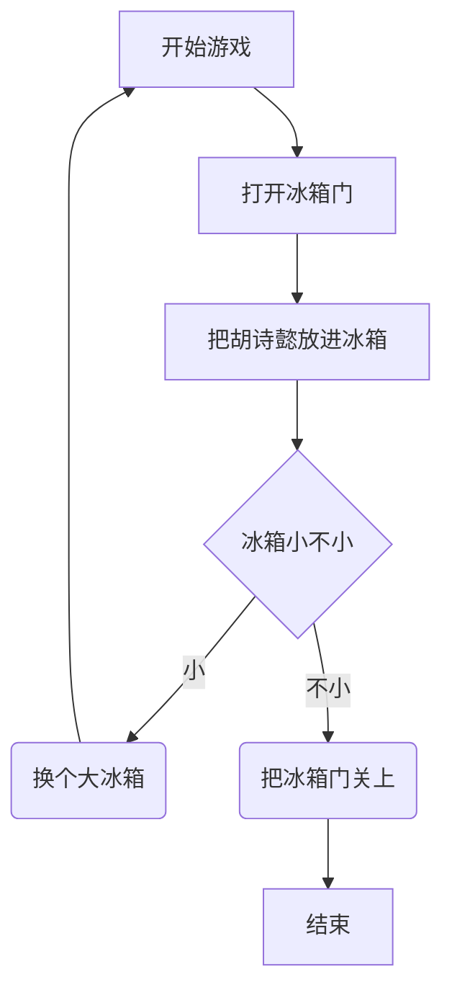
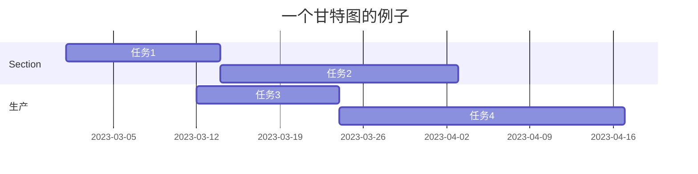
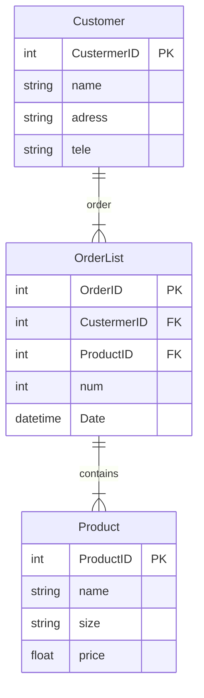

``` mermaid
flowchart TD
A[开始游戏] --> B[打开冰箱门]
B[打开冰箱门] --> Put[把胡诗懿放进冰箱]
Put --> Choose{"冰箱小不小"}
Choose -->|小| C(换个大冰箱)
C --> A
Choose -->|不小| D(把冰箱门关上)
D --> End[结束]
```

```mermaid
gantt
    title 一个甘特图的例子
    dateFormat  YYYY-MM-DD
    section Section
    任务1 : 2023-03-01, 13d
    任务2 : 20d
    section 生产
    任务3 : 2023-03-12  , 12d
    任务4 : 24d

```

```mermaid
erDiagram
	Customer{
        int CustermerID PK
        string name
        string adress
        string tele
    }
    OrderList{
    	int OrderID PK
    	int CustermerID FK
    	int ProductID FK
    	int num
    	datetime Date
    }
    Product{
    	int ProductID PK
    	string name
    	string size
    	float price
    }
    Customer ||--|{ OrderList: order
    OrderList||--|{ Product : contains

```