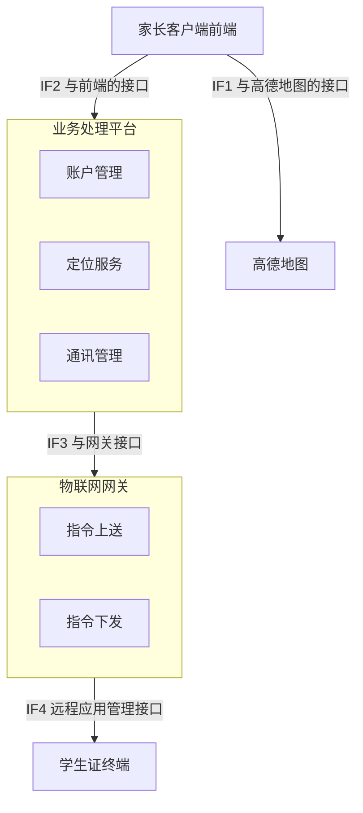
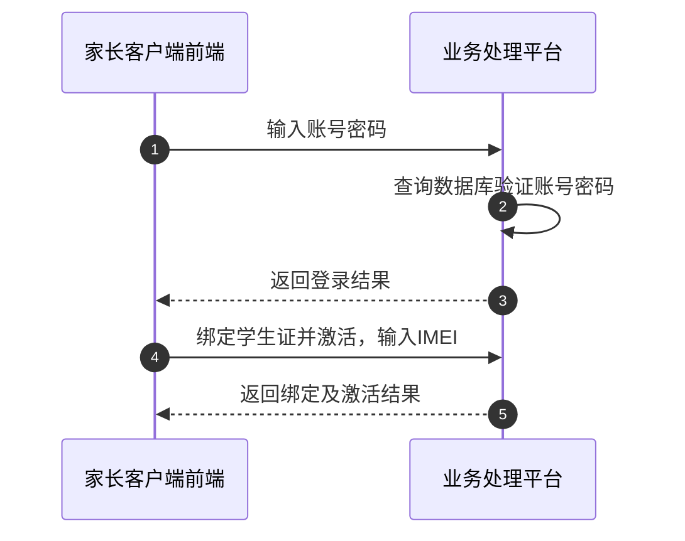
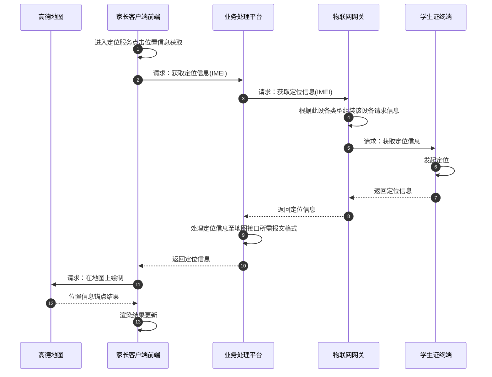
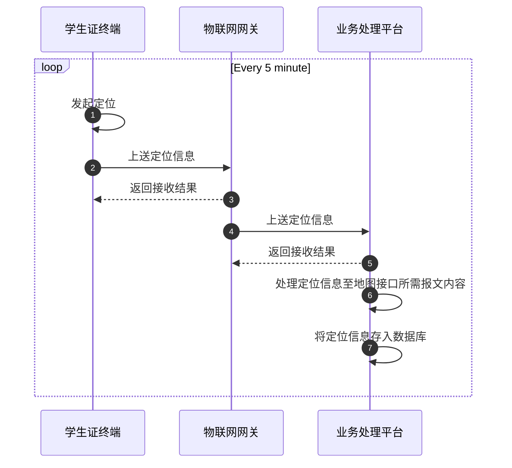
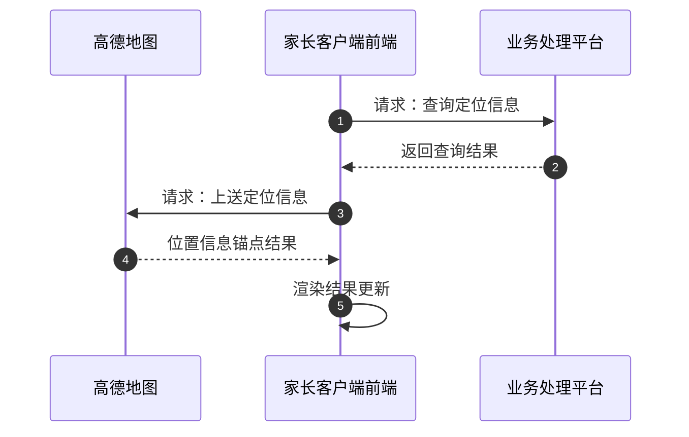
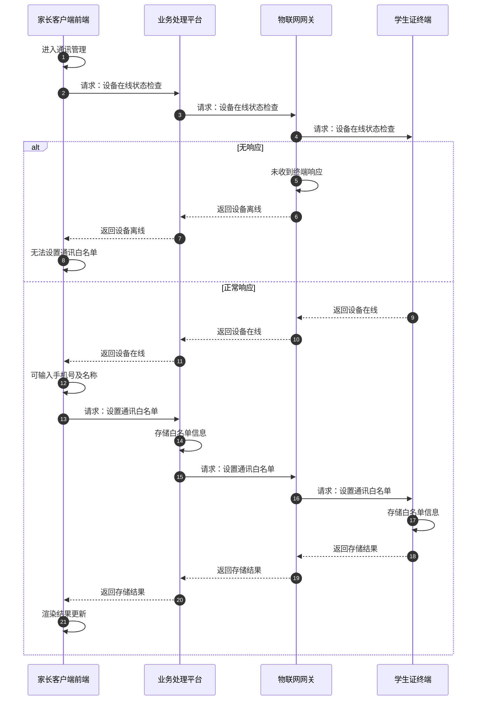
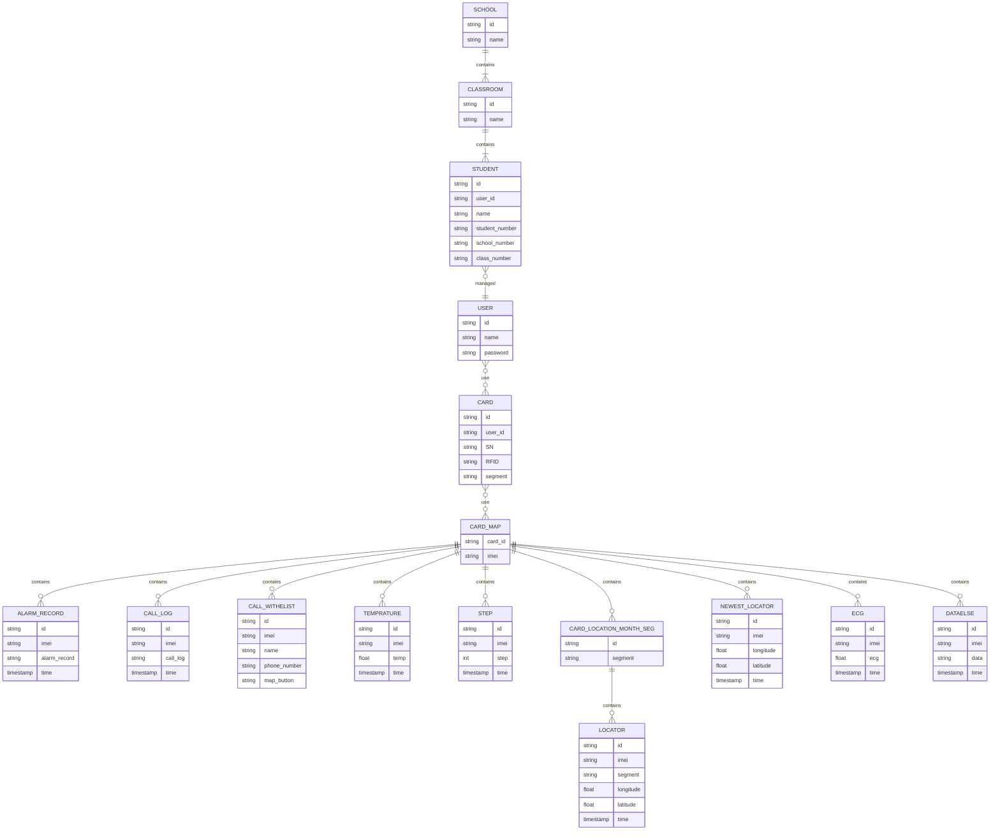

# 数币学生证业务处理平台开发设计

> 文档类型：设计文档  
> 所属系统：数币学生证系统  
> 英文名称：digital currency electronic payment student card system  
> 文档维护：魏超雄  
> 电子邮件：<weicx@bhz.com.cn>  
> 控制范围：公共研发组  
> 文件版本：V0.01

## 1. 概述

> 本开发设计文档仅基于第一期开发需求进行设计，包括和其他平台的接口设计、数据库设计；

1. 对接平台：**物联网设备网关**及**家长客户端展示前端**；
2. 涉及功能点

| 模块     | 功能点                   |
| -------- | ------------------------ |
| 账号管理 | 账号登录、退出与密码管理 |
| 账号管理 | 学生证绑定               |
| 定位服务 | 定位信息获取             |
| 定位服务 | 定位信息展示             |
| 定位服务 | 移动轨迹查询             |
| 通讯管理 | 通讯白名单管理           |

## 2. 总体架构



## 3. 业务流程

### 3.1. 账户管理



//TODO 激活前使用预制密钥进行密文传输，激活过程客户端写入服务端写入的个人化密钥，激活后使用个人化密钥进行密文传输；  
//TODO 了解其他厂商使用 IMEI 对平台和设备做绑定的原因和优势，为什么不用 SN；

### 3.2. 定位服务

#### 3.2.1. 定位信息获取



1. 方案一：在主动获取定位时，学生证响应包括定位信息
2. 方案二：在主动获取定位时，学生证改变上送频率，eg：1s 上送一次，持续 20s；
3. 建议两种方案结合

#### 3.2.2. 定位信息展示

#### 3.2.2. 定位信息上送



#### 3.2.2. 定位信息查询



// TODO 具体物联网网关与学生证终端数据交互；  
//TODO 前端入参，获取历史定位信息；需要获取最新记录和历史轨迹（两个接口）；
针对最新记录的入参：定位表的此 IMEI 的此账户的最新一条记录的全部信息，userId，IMEI；
针对历史记录的入参：定位表的此 IMEI 的此账户的指定时间范围的默认分页信息，userId，IMEI，开始时间，结束时间；  
//TODO 地图承载列表总数，指定范围内的内容是否全量，指定范围内超出某个阈值时是否只返前多少条；

```sql
select a.* from 设备最新定位信息表 a 
left join 设备信息表 b on a.平台设备编号 = b.平台设备编号  
where a.账户=? and b.IMEI=? ;
```

```sql
// 联表查询
select a.* from 定位信息表 a 
left join 设备信息表 b on a.平台设备编号 = b.平台设备编号  
where a.账户=? and b.IMEI=?  and （开始时间<=a.时间＜=结束时间 ）
order by 定位时间 
limit 0,10 ;
```

### 3.3. 通讯管理



//TODO 等待时长发送频率待讨论；

## 4. 数据库设计

### 4.1. 学生证数据

- 多种与学生证有关的，测量设备、测量数据的管理和统计，在统一管理平台进行管理，并提供服务给客户端；
  - 定位；
  - 告警推送；
  - 通话记录；
  - 考勤；
  - 心率；
  - 计步；
  - 测温；
  - 其他拓展功能
- 多种设备，多种数据，统一管理；
- 将设备信息和业务信息，便于底层平台能力服务于上层业务数据；
- 将账户与业务平台，和服务器与设备的绑定关系拆分，故使用map表表达平台设备id和imei独立关联业务平台和设备；
- 学生证数据量产生主要来源于定位信息，假设主动上报定位为 10 分钟/次，定位时间段从当天 6:00-24:00，并加上主动定位，则稳妥计算可产生 216 条定位信息,每年78840条，，故推算每台学生证每天的数据量估算为 300 条以内；单表每年只能支持127台设备，每月支持1522台设备；单表1000个设备
- 号段命名_实际需求去掉3位即可表达1000个号段
- 账户id编码规则使用uuid即可
- 平台设备编码规则对此需要能够识别此设备信息为佳，学生证/学校/教师/学生

### 4.2. ER 图

| Value (left) | Value (right) | Meaning                       |
| ------------ | ------------- | ----------------------------- |
| \|o          | o\|           | Zero or one                   |
| \|\|         | \|\|          | Exactly one                   |
| }o           | o{            | Zero or more (no upper limit) |
| }\|          | \|{           | One or more (no upper limit)  |


